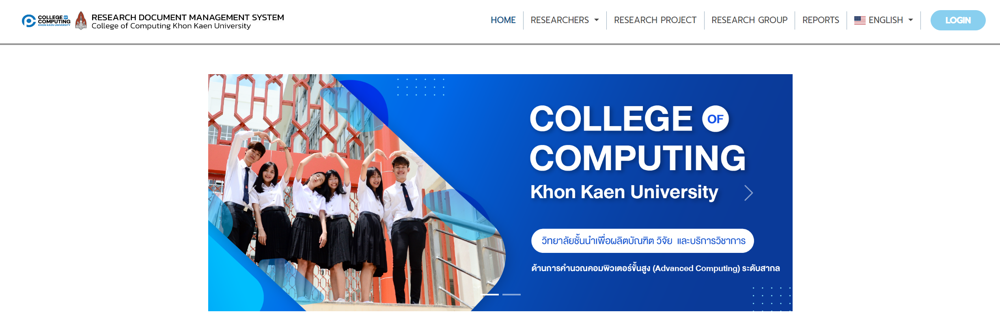
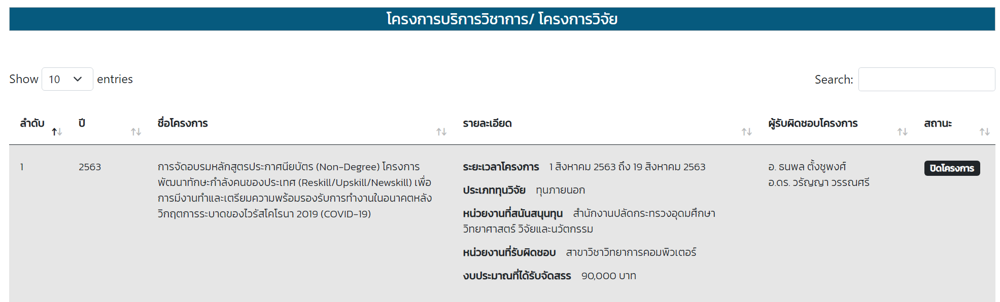
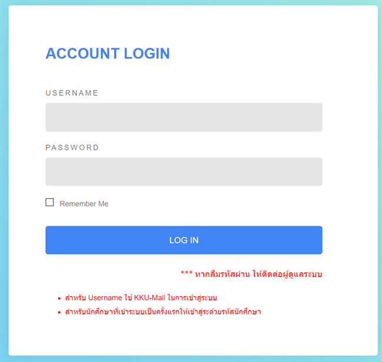
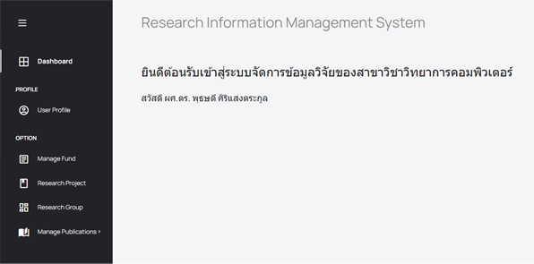
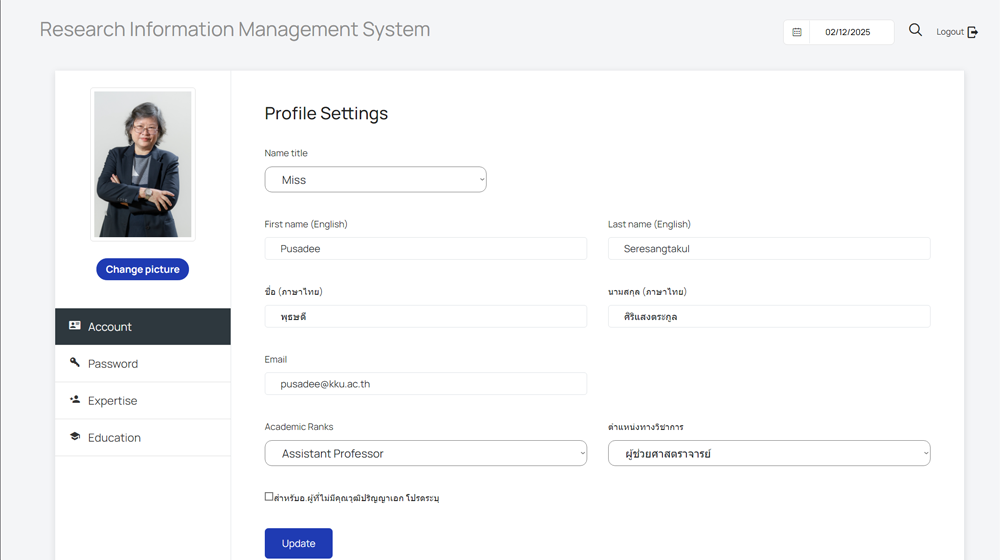
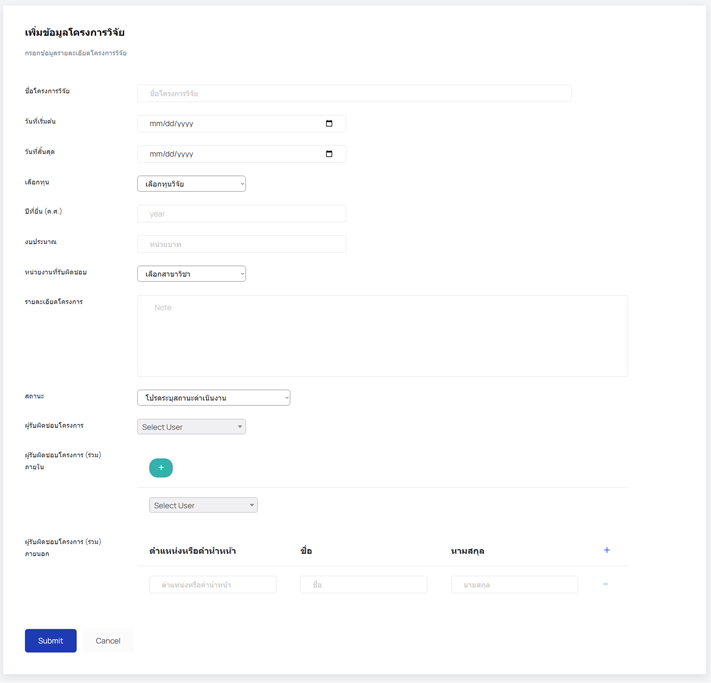
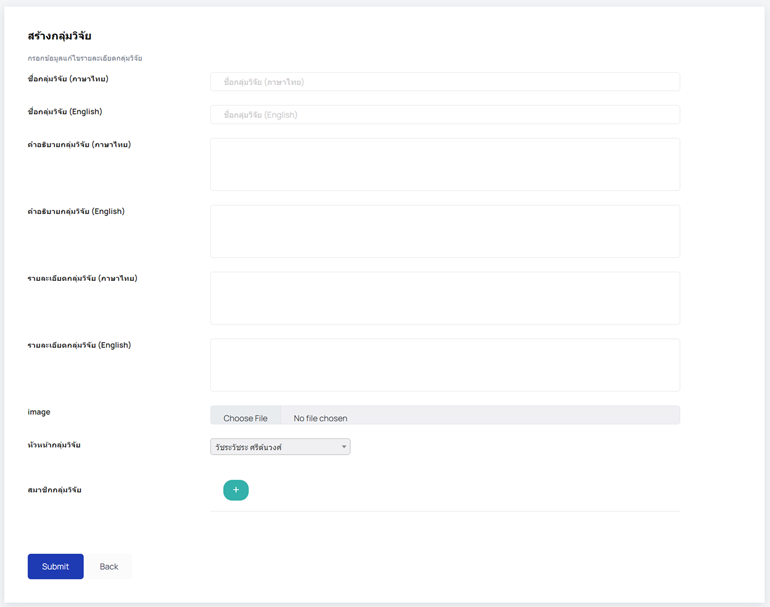
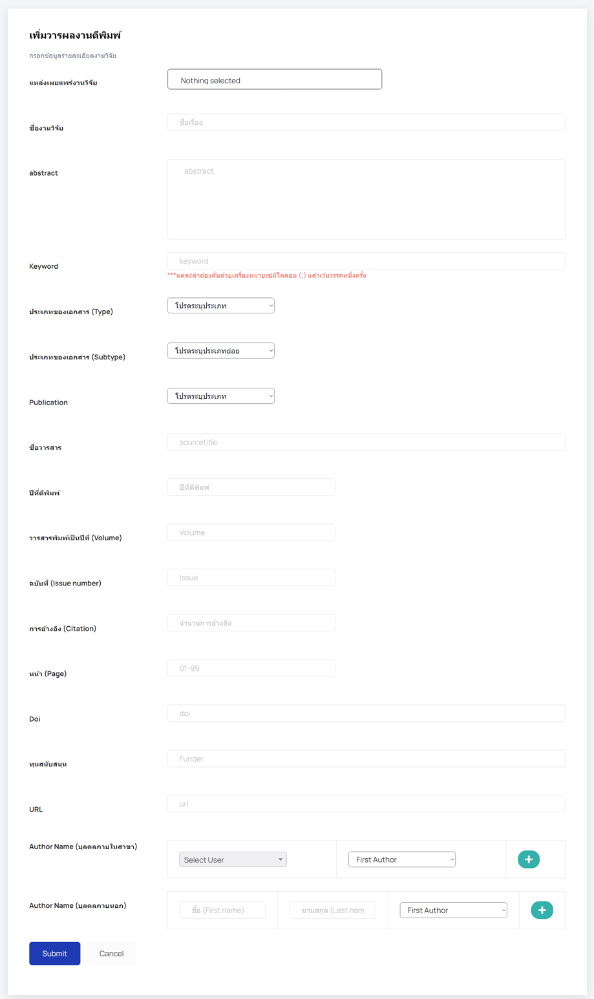
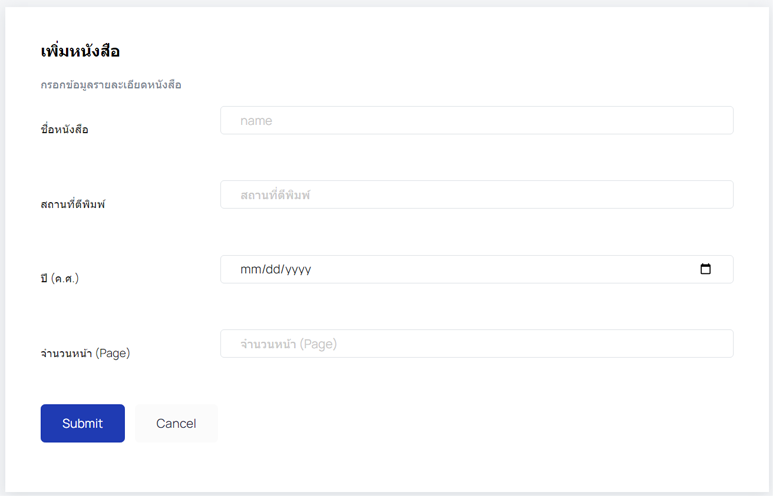
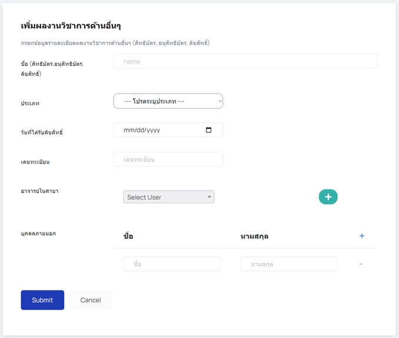

# User Manual

## For Viewers
1. เปิดเว็บเบราว์เซอร์ที่ต้องการใช้งาน
2. ไปที่ URL: [https://cs05sec167.cpkkuhost.com](https://cs05sec167.cpkkuhost.com) เพื่อเข้าใช้งานระบบ

3. ผู้เข้าชมสามารถค้นหางานวิจัยของอาจารย์ได้โดยเลือกตัวเลือก **"Researchers"** หรือค้นหาจากรายละเอียดของงานวิจัยได้ที่ตัวเลือก **"Research Project"**
4. ในหน้า **Research Project** ผู้เข้าชมสามารถค้นหางานวิจัยได้โดยใช้ **ปีที่ตีพิมพ์, ชื่องานวิจัย, รายละเอียดงานวิจัย หรือชื่ออาจารย์**

## For Professors and Admins
1. เปิดเว็บเบราว์เซอร์ที่ต้องการใช้งาน
2. ไปที่ URL: [https://cs05sec167.cpkkuhost.com](https://cs05sec167.cpkkuhost.com) เพื่อเข้าใช้งานระบบ

3. คลิกที่ปุ่ม **"Login"** และกรอก **Username** และ **Password** เพื่อเข้าสู่ระบบ

4. เมื่อเข้าสู่ระบบแล้ว ผู้ใช้จะถูกนำไปยังหน้า **Dashboard**

5. ในหน้า **User Profile** ผู้ใช้สามารถ:
   - แก้ไขข้อมูลส่วนตัว
   - เปลี่ยนรหัสผ่าน
   - อัปเดตรายละเอียดต่างๆ ได้

6. **อาจารย์และเจ้าหน้าที่** สามารถเพิ่มข้อมูล **โครงงานวิจัย** และ **กลุ่มวิจัย** ได้

7. **อาจารย์** สามารถตรวจสอบงานวิจัยที่ถูกตีพิมพ์ และเพิ่มข้อมูลงานวิจัยใหม่ที่ได้รับการตีพิมพ์

8. **อาจารย์** สามารถตรวจสอบและเพิ่มข้อมูล **หนังสือ** ที่เกี่ยวข้อง

9. **อาจารย์และเจ้าหน้าที่** สามารถเพิ่มผลงานวิชาการอื่นๆ เช่น **สิทธิบัตร, อนุสิทธิบัตร และลิขสิทธิ์** รวมถึงดูรายละเอียดและแก้ไขข้อมูลของผลงานได้

