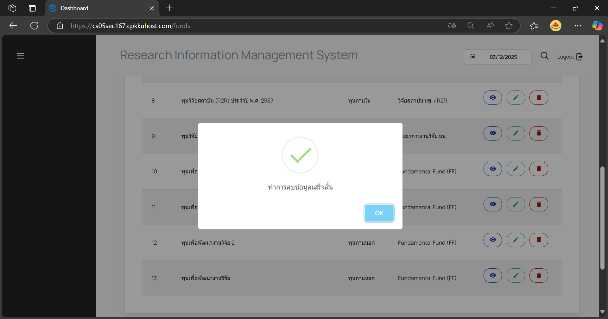

# User Manual

## For Viewers
1. เปิดเว็บเบราว์เซอร์ที่ต้องการใช้งาน
2. ไปที่ URL: [https://cs05sec167.cpkkuhost.com] เพื่อเข้าใช้งานระบบ

3. เลือกเมนู **RESEARCH PROJECT** เพื่อดู **โครงการบริการวิชาการ/โครงการวิจัย**

4. สามารถค้นหา **โครงการบริการวิชาการ/โครงการวิจัย** ได้ที่ช่อง **Search**

## For Administrative staff
1. เข้าสู่ระบบด้วย 
    username : jutaum@kku.ac.th
    password : 123456789

    บัญชีผู้ใช้นี้มี Permission เพิ่ม ลบ แก้ไข และดูรายละเอียด ทุนวิจัยและโครงการบริการวิชาการ/ โครงการวิจัย

2. เมื่อเข้าสู่ระบบสำเร็จจะแสดงหน้าข้อมูลดังภาพ

### Manage Fund

3. ผู้ใช้สามารถเพิ่มทุนวิจัย โดยไปที่เมนู **Option** และกดที่ **Manage Fund**

    กด **ADD**
    

    กรอกข้อมูลที่ต้องการเพิ่ม หากช่องข้อมูลใดมีเครื่องหมาย * ต้องกรอกข้อมูลเสมอ
    

    หากไม่กรอกข้อมูลที่ช่องที่มีเครื่องหมาย จะไม่สามารถเพิ่มทุนวิจัยได้
    

    ต้องกรอกให้ครบจึงจะสามารถเพิ่มทุนวิจัยได้
    

4. ผู้ใช้สามารถแก้ไขทุนวิจัย โดยไปที่เมนู **Option** และกดที่ **Manage Fund**
    กด **Edit** ไอคอนดินสอ ที่ทุนวิจัยที่ต้องการแก้ไข 
    
    

    แก้ไขข้อมูลและกด **บันทึก** เพื่ออัปเดตข้อมูล
    
    

5. ผู้ใช้สามารถดูรายละเอียดทุนวิจัย โดยไปที่เมนู **Option** และกดที่ **Manage Fund**
    กด **view** ไอคอนดวงตา ที่ทุนวิจัยที่ต้องการดูรายละเอียด
    
    

6. ผู้ใช้สามารถลบทุนวิจัย โดยไปที่เมนู **Option** และกดที่ **Manage Fund**
    กด **Delete** ไอคอนถังขยะ ที่ทุนวิจัยที่ต้องการลบ
    

    จะมี pop up แจ้งเตือน ให้ยืนยันการลบ
    

    หากต้องการลบให้กดที่ **OK** เมื่อการลบเสร็จสิ้น จะแสดง pop up ดังภาพ
    

### Reseach Project

7. ผู้ใช้สามารถเพิ่มโครงการวิจัย โดยไปที่เมนู **Option** และกดที่ **Reseach Project**
    

    กด **ADD**
    

    กรอกข้อมูลที่ต้องการเพิ่ม หากช่องข้อมูลใดมีเครื่องหมาย * ต้องกรอกข้อมูลเสมอ
    

    check box แสดงงบประมาณ ผู้ใช้สามารถเลือกได้ว่าต้องการแสดงงบประมาณให้ผู้เข้าชมเห็นหรือไม่
    

    เมื่อกรอกข้อมูลเรียบร้อย กด **Submit** เพื่อบันทึกข้อมูล
    

    pop up แสดง เพิ่มโครงการวิจัยสำเร็จ
    

8. ผู้ใช้สามารถเพิ่มโครงการวิจัย โดยไปที่เมนู **Option** และกดที่ **Reseach Project**
    กด **Edit** ไอคอนดินสอ ที่โครงการวิจัยที่ต้องการแก้ไข 
    
    

    แก้ไขข้อมูลและกด **Submit** เพื่ออัปเดตข้อมูล
    
    

9. ผู้ใช้สามารถดูรายละเอียดโครงการวิจัย โดยไปที่เมนู **Option** และกดที่ **Reseach Project**
    กด **view** ไอคอนดวงตา ที่ทุนวิจัยที่ต้องการดูรายละเอียด
    
    

6. ผู้ใช้สามารถลบโครงการวิจัย โดยไปที่เมนู โดยไปที่เมนู **Option** และกดที่ **Reseach Project**
    กด **Delete** ไอคอนถังขยะ ที่ทุนวิจัยที่ต้องการลบ
    

    จะมี pop up แจ้งเตือน ให้ยืนยันการลบ
    

    หากต้องการลบให้กดที่ **OK** เมื่อการลบเสร็จสิ้น จะแสดง pop up ดังภาพ
    
    